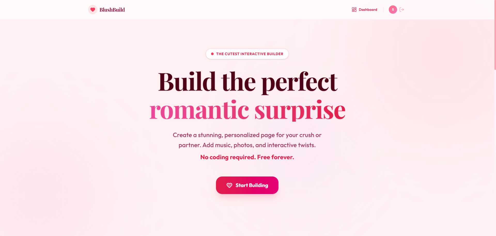
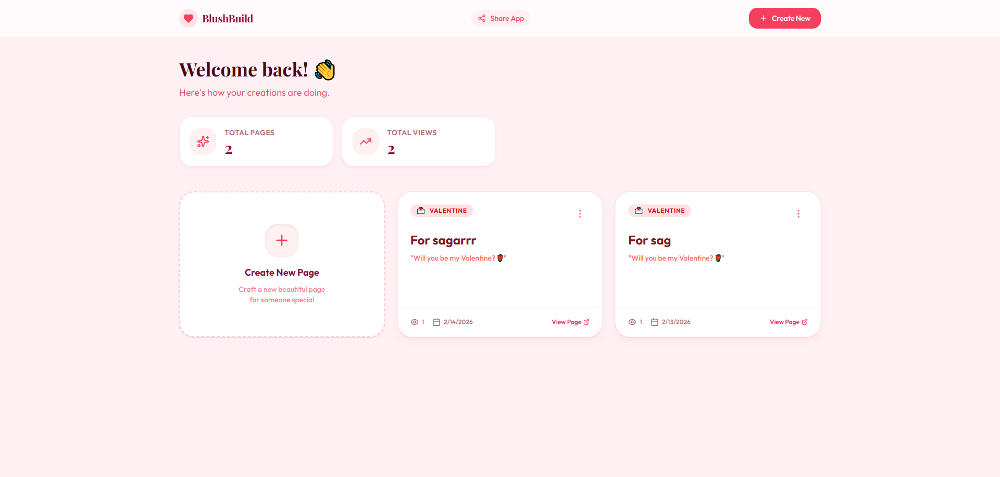
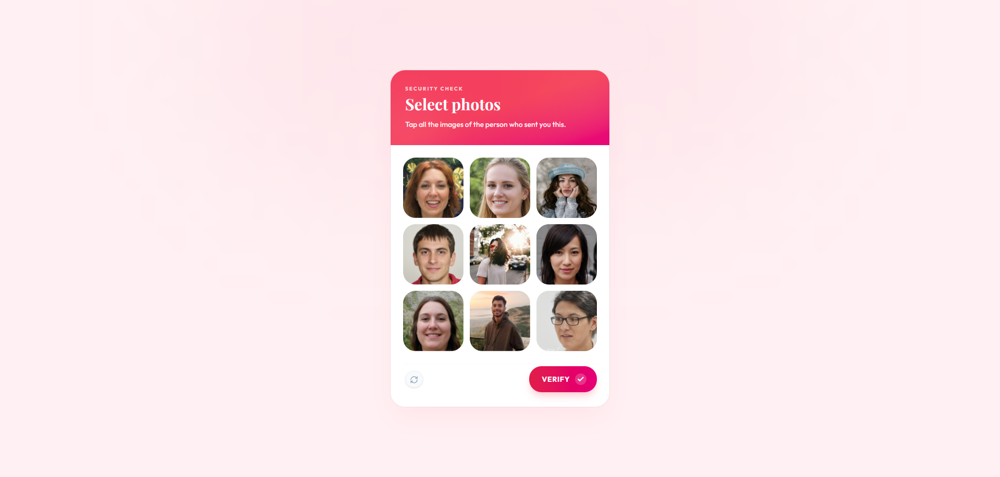

# Blush Build

**Blush Build** is the cutest way to create personalized, interactive romantic pages. Effortlessly add heartfelt messages, background music, cherished photos and fun interactive elements, all password protected and ready to share instantly via a simple link.

**Live Site:** [https://blush-build.xyz](https://blush-build.xyz)

## Application Preview

<div align="center">
  
  <br/><br/>

  
  <br/><br/>

  
</div>

## Features

- **Heart Captcha & Puzzles**: Interactive locking mechanisms that require users to solve puzzles (like assembling a heart) to access content.
- **Secure Gates**: Protect your pages with passwords, dates, or custom questions to ensure only the right people see your message.
- **Rich Media Uploads**: Seamlessly upload and display photos and videos using Cloudinary integration.
- **Custom Reveals**: Design beautiful reveal animations and introductions for your content.
- **Dashboard Management**: A user-friendly dashboard to create, edit, and manage all your deployed pages.
- **High Performance**: Built on Next.js 16 for blazing fast load times and smooth transitions.

## Tech Stack

### Frontend
- **Framework**: Next.js 16 (App Router)
- **Language**: TypeScript
- **Styling**: Tailwind CSS 4, Radix UI
- **Icons**: Lucide React
- **Animations**: Canvas Confetti, CSS Animations

### Backend & Database
- **Runtime**: Node.js
- **Database**: PostgreSQL (via Neon Serverless)
- **ORM**: Drizzle ORM
- **Authentication**: Custom JWT Auth with Secure Cookies
- **Storage**: Cloudinary

## Getting Started

Follow these steps to set up the project locally.

### Prerequisites

- **Node.js**: v18 or higher
- **npm/yarn/pnpm**: Package manager of your choice

### 1. Installation

Clone the repository and install dependencies:

```sh
git clone https://github.com/Sagar-1103/blush-build.git
cd blush-build
npm install
```

### 2. Environment Configuration

Create a `.env` file in the root directory and add the necessary variables:

#### **`.env`**
| Variable | Description |
| :--- | :--- |
| `DATABASE_URL` | PostgreSQL connection string (Neon DB) |
| `NEXT_PUBLIC_CLOUDINARY_CLOUD_NAME` | Cloudinary Cloud Name |
| `CLOUDINARY_API_KEY` | Cloudinary API Key |
| `CLOUDINARY_API_SECRET` | Cloudinary API Secret |
| `JWT_SECRET` | Secret key for signing JWT tokens |

### 3. Database Setup

This project uses [Drizzle ORM](https://orm.drizzle.team/) with PostgreSQL.

1.  **Push Schema to Database**:
    Sync your local schema with your Neon (PostgreSQL) database.
    ```sh
    npx drizzle-kit push
    ```

2.  **View Database (Optional)**:
    Open Drizzle Studio to inspect and manage your data.
    ```sh
    npx drizzle-kit studio
    ```

### 4. Running the Project

Start the development server:

```sh
npm run dev
```

Open [http://localhost:3000](http://localhost:3000) with your browser to see the result.

## Project Structure

```text
.
├── app/              # Next.js App Router pages and API routes
├── components/       # Reusable React components
│   ├── ui/           # Basic UI primitives (buttons, inputs)
├── lib/              # Utility functions and authentication logic
├── src/
│   └── db/           # Database schema and Drizzle connection
├── public/           # Static assets
└── types/            # TypeScript type definitions
```
